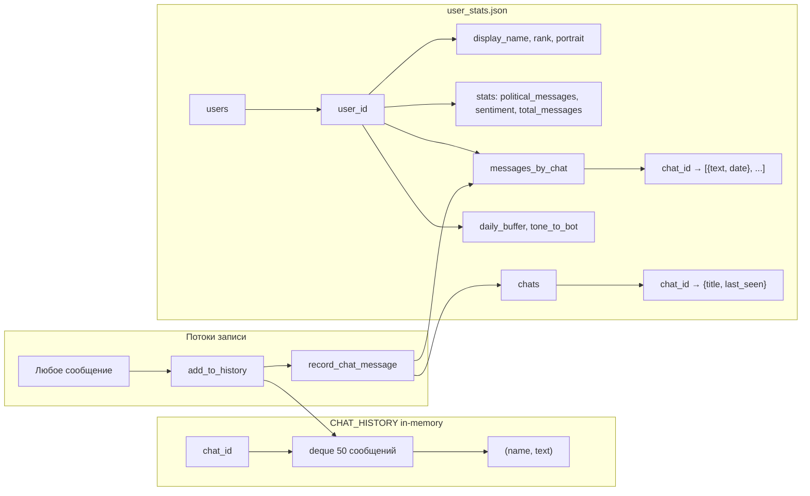

# Логика работы бота «Политмонитор»

## Общая идея

Бот следит за диалогом в Telegram-чате и **реагирует на политические темы**:
- **Замечает** при негативе/нейтрале к президенту РФ
- **Поощряет** при позитиве к президенту РФ
- **Отвечает** на обращения к себе (упоминание @бот, ответ на сообщение бота)

---

## Архитектура компонентов

```
┌─────────────────┐     ┌─────────────────┐     ┌─────────────────┐
│     bot.py      │────▶│  ai_analyzer.py │     │  user_stats.py  │
│  (хендлеры,     │     │  (ИИ: анализ,   │     │  (статистика,   │
│   логика чата)  │     │   генерация)    │     │   архив, портреты)
└────────┬────────┘     └─────────────────┘     └────────┬────────┘
         │                                                        │
         └──────────────────────┬─────────────────────────────────┘
                                ▼
                    ┌───────────────────────┐
                    │    user_stats.json    │
                    │  (users, chats,       │
                    │   messages_by_chat)   │
                    └───────────────────────┘
```

---

## Порядок обработки сообщений (aiogram)

Сообщение проходит через **фильтры по порядку** (первый совпавший — обрабатывается):

1. **Команды**: `/start`, `/ranks`, `/stats`
2. **Новые участники**: бот добавлен в чат → приветствие
3. **Обращение к боту** (`IsDirectedAtBotFilter`): ответ на бота или @username
4. **Любое сообщение** в чат: `check_and_reply` — мониторинг политики

---

## Блок-схема: обработка сообщения в чате

```mermaid
flowchart TD
    subgraph Входящее сообщение
        A[Сообщение в чат] --> B{Тип?}
    end

    B -->|/start, /ranks, /stats| C[Команда]
    B -->|Бот добавлен| D[Приветствие]
    B -->|@бот или ответ на бота| E[on_message_to_bot]
    B -->|Обычное сообщение| F[check_and_reply]

    C --> C1[Ответ по команде]
    D --> D1[GREETING]
    
    subgraph Обращение к боту
        E --> E1[add_to_history + record_chat_message]
        E1 --> E2[record_message_to_bot]
        E2 --> E3{ИИ: политика + тональность}
        E3 -->|positive / friendly| E4[generate_kind_reply]
        E3 -->|технический вопрос| E5[generate_technical_reply]
        E3 -->|остальное| E6[generate_rude_reply + портрет]
        E4 --> E7[Отправить ответ]
        E5 --> E7
        E6 --> E7
    end

    subgraph Мониторинг политики
        F --> F1[add_to_history + record_chat_message]
        F1 --> F2{Есть полит. ключевые слова?}
        F2 -->|Нет| F3[Выход]
        F2 -->|Да| F4[_chat_political_count++]
        F4 --> F5{count >= 5?}
        F5 -->|Нет| F3
        F5 -->|Да| F6[Отложенный анализ 0.5 сек]
        F6 --> F7[_run_batch_analysis]
        
        F7 --> F8{Стиль чата по 20 сообщениям}
        F8 -->|moderate + без политики| F9[Похвала 1 раз в день]
        F8 -->|moderate| F3
        F8 -->|active/beast| F10{ИИ: политика?}
        
        F10 -->|Нет| F11[25 нейтральных → сброс счётчиков]
        F10 -->|Да| F12{ИИ: sentiment?}
        
        F12 -->|positive| F13[Поощрение 🇷🇺]
        F12 -->|negative/neutral| F14[Замечание + статья УК]
        F14 --> F15[record_warning]
    end
```

---

## Блок-схема: хранение данных



---

## Детальная логика по сценариям

### 1. Обычное сообщение в чате (`check_and_reply`)

| Шаг | Действие |
|-----|----------|
| 1 | Добавить в `CHAT_HISTORY` (до 50 сообщений на чат) |
| 2 | Вызвать `record_chat_message` → архив в `messages_by_chat[chat_id]` |
| 3 | Проверить ключевые слова (`POLITICAL_KEYWORDS`): путин, война, выборы и т.д. |
| 4 | Если есть — `_chat_political_count[chat_id]++` |
| 5 | Если count < 5 → **выход** (терпим 5 полит. сообщений) |
| 6 | Запланировать анализ через 0.5 сек (дедупликация) |
| 7 | `_run_batch_analysis`: взять 20 последних сообщений → ИИ определяет **стиль** (moderate/active/beast) |
| 8 | **moderate** + в пачке нет политики → похвала «без политики» 1 раз в день |
| 9 | **moderate** → не делаем замечаний |
| 10 | **active**: замечание через раз (5-е, 7-е, 9-е...) |
| 11 | **beast**: замечание на каждое после 5-го |
| 12 | ИИ уточняет: политика? sentiment? |
| 13 | Если не политика → 25 нейтральных подряд сбрасывают счётчики |
| 14 | Если **positive** → поощрение («правильные слова!») |
| 15 | Если **negative/neutral** → замечание с эскалацией (level 0→1→2→3+) + статья УК |

### 2. Обращение к боту (`on_message_to_bot`)

| Шаг | Действие |
|-----|----------|
| 1 | То же: `add_to_history` + `record_chat_message` |
| 2 | `record_message_to_bot` → буфер обращений (до 20) |
| 3 | ИИ: `analyze_messages` → is_political, sentiment |
| 4 | **positive** или friendly без политики → `generate_kind_reply` (добрый ответ + «в карму») |
| 5 | Технический вопрос (код, API, настройка) → `generate_technical_reply` |
| 6 | Остальное → `generate_rude_reply` (грубый ответ с учётом портрета пользователя) |
| 7 | 1% шанс добавить «а вчера ты сказал…» из `yesterday_quotes` |

### 3. Портрет и ранги (`user_stats`)

- **Портрет** обновляется раз в день по `daily_buffer` (полит. сообщения)
- **Ранг**: loyal / neutral / opposition / unknown — по счётчикам sentiment
- **tone_to_bot**: ИИ оценивает тон обращений к боту (агрессивен, дружелюбен и т.д.)
- **Архив**: до 1000 сообщений на чат в `messages_by_chat`
- **Глубокий портрет**: админ-панель строит по архиву через `build_deep_portrait_from_messages`

---

## Константы и пороги

| Параметр | Значение | Смысл |
|----------|----------|-------|
| `MSGS_BEFORE_REACT` | 5 | Сколько полит. сообщений «терпим» до первой реакции |
| `BATCH_SIZE` | 20 | Пачка сообщений для определения стиля чата |
| `API_MIN_INTERVAL` | 12 сек | Минимальный интервал между вызовами ИИ по чату |
| `KEYWORD_CHECK_DELAY` | 0.5 сек | Задержка перед анализом (собрать контекст) |
| `RESET_AFTER_NEUTRAL_MSGS` | 25 | Нейтральных подряд → сброс счётчиков |
| `HISTORY_SIZE` | 50 | Сообщений в памяти на чат |
| `MESSAGES_ARCHIVE_LIMIT` | 1000 | Сообщений в архиве на чат на пользователя |

---

## Админ-панель (`admin_app.py`)

- **Список пользователей** по чатам (вкладки)
- **Портрет, ранги, настроение** к боту
- **Кнопка «Составить портрет»** — глубокий анализ по архиву через ИИ
- **Очистка архива** по чату или полностью
- **Перезапуск бота** через флаг `restart_bot.flag`
